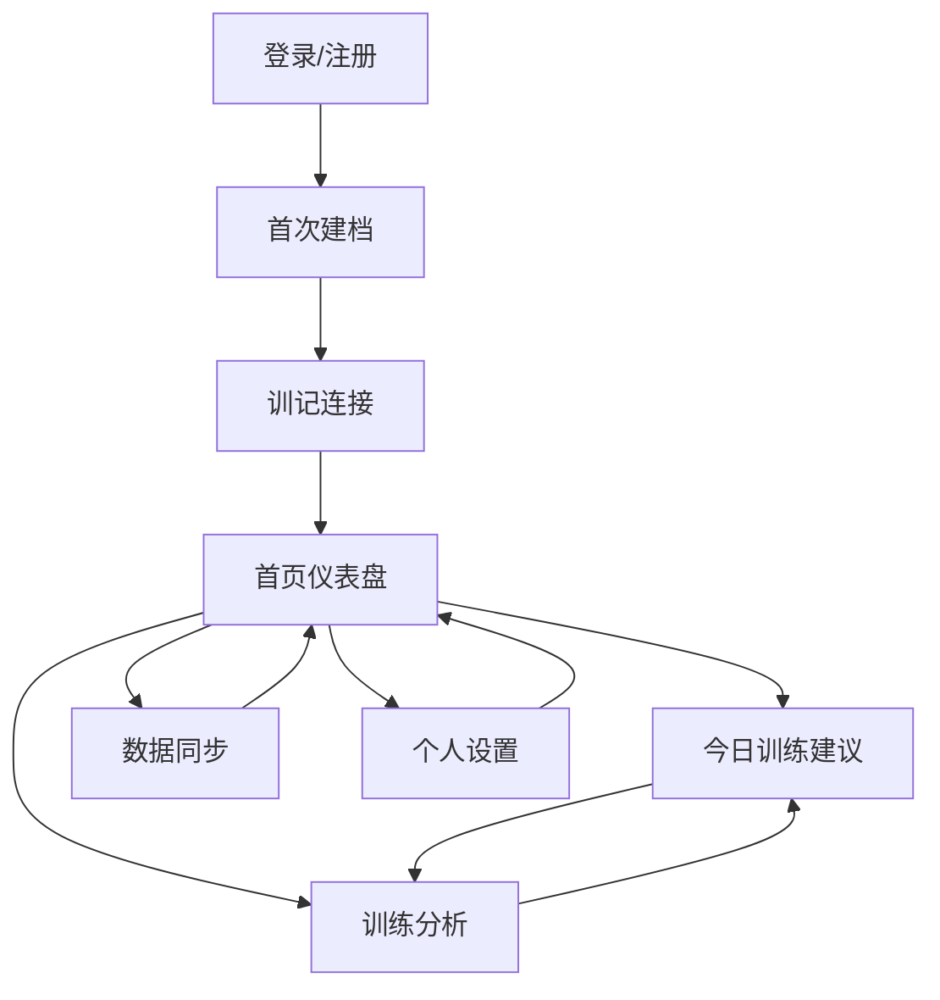

# 健身进阶推荐器页面结构与信息架构 v1.0

> 产品形态：首版 Web
> 
> 目标：明确首版页面、模块、核心内容与用户操作路径，方便进入原型和开发设计阶段

---

# 1. 信息架构总览

首版建议采用以下一级页面结构：

1. 登录 / 注册
2. 首次建档
3. 训记连接
4. 首页仪表盘
5. 今日训练建议
6. 训练分析
7. 数据同步
8. 个人设置

建议 Web 端顶部导航或侧边导航包含：
- 首页
- 今日建议
- 训练分析
- 数据同步
- 设置

---

# 2. 全局导航设计

## 2.1 顶部导航
建议包含：
- Logo / 产品名
- 首页
- 今日建议
- 训练分析
- 数据同步
- 用户头像 / 设置

## 2.2 全局状态条
建议在关键页面顶部显示：
- 最近同步时间
- 当前目标模式（增肌 / 减脂 / 力量）
- 当前训练状态标签

---

# 3. 页面一：登录 / 注册页

## 页面目标
让用户快速进入产品。

## 页面模块
### 1）欢迎区
- 产品标题
- 一句话价值说明
  - 如：连接你的训练记录，告诉你下一次该怎么练

### 2）登录/注册表单
- 邮箱 / 手机号
- 密码
- 登录按钮
- 注册按钮

### 3）补充说明
- 支持连接训记数据
- 面向有训练经验用户

## 用户操作
- 注册后进入首次建档
- 老用户登录后直达首页

---

# 4. 页面二：首次建档页

## 页面目标
收集推荐引擎所需最小必要信息。

## 页面结构
建议做成分步表单，共 4 步。

## Step 1：基础信息
字段：
- 性别
- 年龄
- 身高
- 体重
- 体脂率（可选）

## Step 2：训练信息
字段：
- 训练年限
- 每周训练频率
- 当前训练分化
- 常见训练日安排

## Step 3：目标信息
字段：
- 当前主目标
  - 增肌
  - 减脂保肌
  - 力量提升
- 是否有强化部位

## Step 4：恢复与饮食
字段：
- 平均睡眠时长
- 压力等级
- 日常活动量
- 是否有疼痛/旧伤
- 当前饮食阶段
- 饮食执行稳定度
- 蛋白质摄入大致是否达标

## 页面要求
- 每一步尽量控制在 5-7 个字段内
- 用非技术化语言表述
- 支持“返回上一步”

## 提交后去向
- 跳转到训记连接页

---

# 5. 页面三：训记连接页

## 页面目标
帮助用户绑定训记 API Key，并完成首次同步。

## 页面模块

### 1）连接说明卡片
说明：
- 为什么需要连接训记
- 会读取哪些训练数据
- 不会读取哪些隐私信息（如适用）

### 2）API Key 输入区
- API Key 输入框
- 连接按钮

### 3）同步反馈区
状态包括：
- 未连接
- 连接中
- 已连接
- 同步成功
- 同步失败

### 4）首次同步结果摘要
展示：
- 导入训练天数
- 导入动作数
- 导入记录时间范围

## 页面要求
- 失败时给出清晰可执行提示
- 成功后提供“开始分析”按钮

## 提交后去向
- 跳转首页仪表盘

---

# 6. 页面四：首页仪表盘

## 页面目标
给用户一个当前训练状态总览，并引导进入“今日建议”。

## 页面结构

### 1）顶部状态卡
展示：
- 当前训练状态
  - 正常推进 / 保守推进 / 维持 / 恢复调整 / 减脂保护
- 当前目标模式
- 最近同步时间

### 2）今日建议摘要卡
展示：
- 今日训练日类型
- 今日建议结论
- 关键动作 1-3 条摘要
- 按钮：查看完整建议

### 3）近期状态摘要卡
展示：
- 近期进步较好的动作
- 当前停滞动作
- 疲劳偏高的部位

### 4）恢复与饮食提醒卡
展示：
- 睡眠提醒
- 减脂期提醒
- 蛋白质摄入提醒

### 5）周期建议卡
展示：
- 本周训练倾向
- 是否接近减量周
- 是否建议切换进阶策略

## 页面目标动作
- 点击进入今日训练建议页
- 点击进入训练分析页
- 点击进入数据同步页

---

# 7. 页面五：今日训练建议页

## 页面目标
输出最核心的可执行计划。

## 页面结构

### 1）训练日头部信息
展示：
- 训练日名称（如推 / 拉 / 腿 / 上肢 / 下肢）
- 今日建议类型
- 建议摘要

例如：
- 今日建议：保守推进
- 原因：上肢主项状态稳定，但整体恢复一般

### 2）动作建议列表（核心模块）
每个动作卡片展示：
- 动作名称
- 标签：主项 / 辅助 / 孤立
- 建议状态：加重 / 维持 / 减量 / 替换
- 建议重量
- 建议组数
- 建议次数范围
- 强度说明
- 原因解释

### 3）本次训练总提醒
展示：
- 本次建议节奏
- 是否减少辅助项
- 是否避免冲最后一组

### 4）底部提醒区
展示：
- 恢复提醒
- 饮食提醒
- 数据可信度说明（如果需要）

## 页面设计要求
- 把“建议状态”做成最醒目的视觉元素
- 原因说明要短，避免堆积专业术语
- 可折叠查看更详细解释

---

# 8. 页面六：训练分析页

## 页面目标
让用户理解推荐背后的分析逻辑和近期趋势。

## 页面结构

### 1）关键动作趋势区
展示：
- 主项动作最近表现趋势
- 例如卧推、深蹲、硬拉、肩推等

可展示内容：
- 最近 3 次记录
- 完成情况
- 是否达到进阶条件

### 2）肌群训练量概览区
展示：
- 胸 / 背 / 肩 / 腿 / 手臂等训练量概况
- 标注：偏低 / 适中 / 偏高

### 3）状态诊断区
展示：
- 当前判断为哪类训练状态
- 为什么是这个判断
- 哪些因素影响了建议

### 4）平台期提示区
展示：
- 哪些动作疑似平台期
- 推荐做什么调整

### 5）周期建议区
展示：
- 本周建议
- 未来 1-2 周方向

## 页面要求
- 用可视化和标签表达，不要纯文字堆砌
- 保持解释简洁

---

# 9. 页面七：数据同步页

## 页面目标
让用户管理训记连接与同步状态。

## 页面结构

### 1）连接状态卡
展示：
- 训记连接状态
- API Key 是否有效
- 最近成功同步时间

### 2）同步操作区
- 立即同步按钮
- 重新连接按钮
- 更新 API Key 按钮

### 3）同步记录区
展示：
- 最近几次同步结果
- 同步时间
- 成功/失败
- 失败原因

### 4）数据范围摘要区
展示：
- 当前已导入记录时间范围
- 总训练次数
- 总动作数

---

# 10. 页面八：个人设置页

## 页面目标
让用户维护个人目标与基础信息。

## 页面模块

### 1）基础资料
- 身高
- 体重
- 体脂率

### 2）训练设置
- 每周训练频率
- 训练分化
- 强化部位
- 训练目标

### 3）恢复与饮食设置
- 睡眠
- 压力
- 活动量
- 饮食阶段
- 蛋白质达标情况

### 4）账户设置
- 修改密码
- 退出登录

## 页面要求
- 修改后提示会影响推荐结果

---

# 11. 页面跳转关系

---

# 12. MVP 页面优先级

## P0 页面
- 登录/注册
- 首次建档
- 训记连接
- 首页仪表盘
- 今日训练建议

## P1 页面
- 训练分析
- 数据同步
- 个人设置

---

# 13. 首版设计原则

## 13.1 简洁优先
首版最重要的是“建议可执行”，不是页面很复杂。

## 13.2 结果优先
用户进来最想看的不是图表，而是：
- 我今天怎么练
- 哪个动作该不该加重量

## 13.3 解释适度
每条推荐都要有理由，但理由要短、明确、好理解。

## 13.4 强反馈
“加重 / 维持 / 减量”必须一眼能看懂。

---

# 14. 页面结构结论

首版 Web 页面应围绕一个核心目标展开：

> 让用户在最短时间内看到自己的当前状态，并拿到下一次训练的具体建议。

因此，页面结构应优先服务这个核心闭环，而不是过早扩展成复杂平台。

